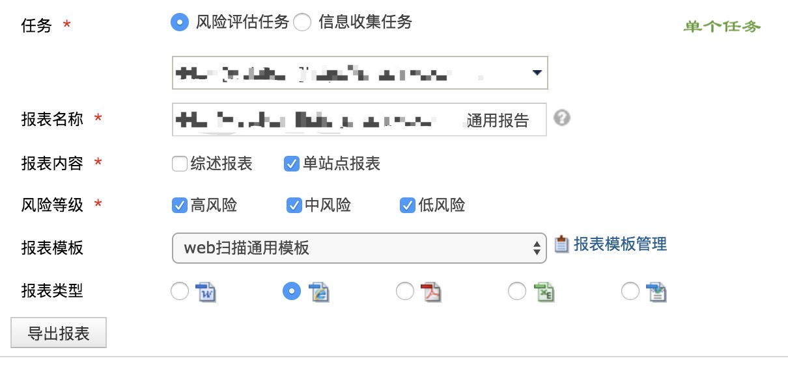
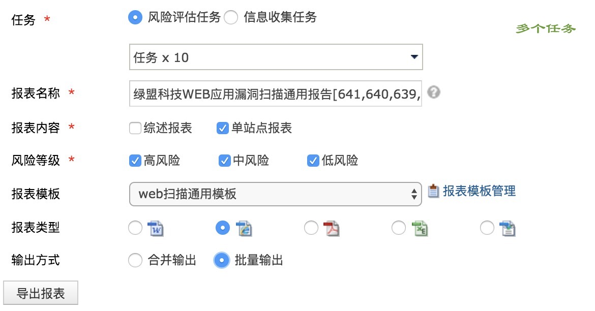
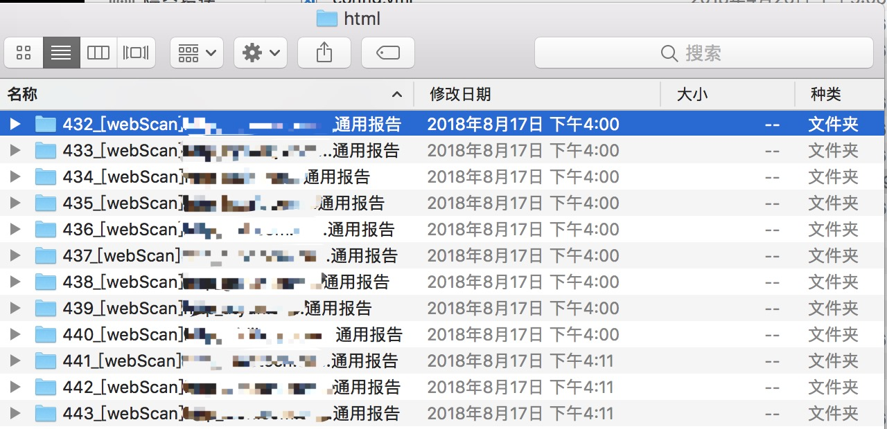
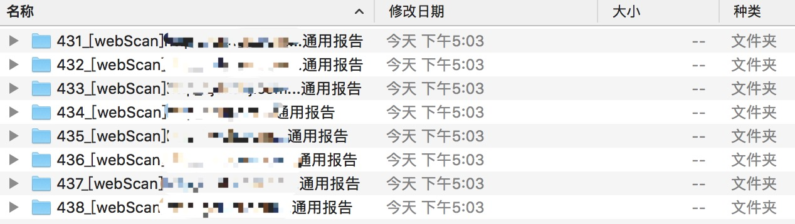

##漏扫报告整理工具.简版(无图表)v2.2 使用说明
###### author: hjxfire
###### Copyright (C) 2018 hjxfire <hjxfire@outlook.com>
###1. 环境
系统：linux,unix
语言：python 3.6.5
包：bs4,docx,openpyxl
###2. 使用
工具包括5个文件夹，一个可运行文件以及一个README文件夹。
excel/中存放汇总表
html/中存放导出的html格式的报告
template/中存放简报模板
pdf/中存放导出的pdf格式的详细报告
word/中存放程序输出的简版报告

1. 进入wvss，点击报表输出,导出html格式的报告,注意多个任务点选`批量输出`
   
   
2. 同样方式,导出pdf格式的详细报告
3. 解压下载的报告
4. 将html格式的报告(整个文件夹)放入html/目录下
   
5. 将pdf格式的报告(不是整个文件夹)放入pdf/目录下(有数据的pdf报告解压出来是一个文件夹,把里面的pdf取出即可,无数据的pdf报告解压出来是一个pdf文件,不用放入pdf/目录,这里有些麻烦,会在下一次更新中改进)
   
6. 将汇总表放入excel/目录下
7. 将漏扫报告(简版)放入template/目录下(无数据的简报)
8. 命令行运行,汇总表中没有找到的地址会在控制台显示出来
   ```
   python3 start.py
   ```
9. excel/目录下获得整理好的**汇总表** 
    pdf/目录下获得整理好的**详细版报告**
   word/目录下获得整理好的**简版报告**
<hr style="background-color: rgb(25, 172, 230);height: 1px;">

####tips:
1. 系统要求是linux/unix是因为偷懒使用了shell命令,共使用了两条命令,分别是cp和mv,可以使用python自己的文件处理命令替换,windows下也可以直接替换为windows的命令.
2. 选择从html中提取报告是因为当前html中信息比较全,后面可视情况更改.
3. `合并输出`的效果是将所有报告的html合并在一个文件夹里,`批量输出`的效果就是一个一个导出的效果,可以自主修改代码适配.
4. 要求无数据,未填写的简报作为模板是因为当前docx模块对table中单个单元格没有更改字体和字号的函数,所有用游程run'曲线救国',使用的是添加,不是覆盖,因此有数据的模板还需要删除数据,每个报告都要先删除模板数据再写有点浪费时间.

<hr style="background-color: rgb(25, 172, 230);height: 1px;">

####v2.2更新
1. 放置简版报告模板的目录由module/改为template/